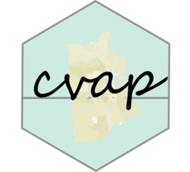

<!-- README.md is generated from README.Rmd. Please edit that file -->

# cvap
<a href='https://christophertkenny.com/cvap/'></a>

<!-- badges: start -->

[](https://github.com/christopherkenny/cvap/actions)
<!-- badges: end -->

The goal of `cvap` is to work with Census citizen voting-age population
(CVAP) data.

## Installation

You can install the released version of cvap from
[CRAN](https://CRAN.R-project.org) with:

``` r
install.packages("cvap")
```

Install the development version from [GitHub](https://github.com/) with:

``` r
# install.packages("devtools")
devtools::install_github("christopherkenny/cvap")
```

## Example

The primary tools from this package are to first download CVAP data
that’s already processed.

``` r
library(cvap)
de_cvap <- cvap_get('DE')
```

`cvap_get()` has options for the available geographies in the [Census
special
tabulation](https://www.census.gov/programs-surveys/decennial-census/about/voting-rights/cvap.html).

With that data, we can combine it with ACS and Decennial Census data to
estimate block-level data.

``` r
de_block <- censable::build_dec(geography = 'block', state = 'DE', 
                                year = 2010, geometry = FALSE)
de_block_group <- censable::build_acs(geography = 'block group', state = 'DE', 
                                      geometry = FALSE, year = 2019)
```

For example purposes, the 2010 Delaware Census block data is provided:

``` r
data('de_block')
```

Along with the Delaware 2019 ACS data:

``` r
data('de_block_group')
```

This allows us to distribute the block group data approximately between
blocks.

``` r
block_est <- cvap_distribute(de_cvap, de_block, de_block_group)
```

This workflow can also be combined into one function

``` r
block_est <- cvap_distribute_censable('DE')
```

The resulting data has estimated CVAP data for each block:

``` r
dplyr::glimpse(block_est)
#> Rows: 24,115
#> Columns: 29
#> $ GEOID      <chr> "100010401001000", "100010401001001", "100010401001002", "1~
#> $ NAME       <chr> "Block 1000, Block Group 1, Census Tract 401, Kent County, ~
#> $ pop        <dbl> 77, 294, 20, 91, 53, 6, 50, 0, 0, 21, 294, 19, 0, 23, 42, 0~
#> $ pop_white  <dbl> 53, 280, 20, 91, 50, 6, 47, 0, 0, 19, 261, 18, 0, 23, 41, 0~
#> $ pop_black  <dbl> 9, 5, 0, 0, 0, 0, 3, 0, 0, 0, 19, 1, 0, 0, 1, 0, 1, 0, 0, 1~
#> $ pop_hisp   <dbl> 9, 3, 0, 0, 3, 0, 0, 0, 0, 0, 8, 0, 0, 0, 0, 0, 0, 0, 0, 7,~
#> $ pop_aian   <dbl> 1, 1, 0, 0, 0, 0, 0, 0, 0, 0, 1, 0, 0, 0, 0, 0, 0, 0, 0, 0,~
#> $ pop_asian  <dbl> 1, 0, 0, 0, 0, 0, 0, 0, 0, 0, 1, 0, 0, 0, 0, 0, 0, 0, 0, 0,~
#> $ pop_nhpi   <dbl> 0, 0, 0, 0, 0, 0, 0, 0, 0, 0, 0, 0, 0, 0, 0, 0, 0, 0, 0, 0,~
#> $ pop_other  <dbl> 0, 0, 0, 0, 0, 0, 0, 0, 0, 0, 0, 0, 0, 0, 0, 0, 0, 0, 0, 0,~
#> $ pop_two    <dbl> 4, 5, 0, 0, 0, 0, 0, 0, 0, 2, 4, 0, 0, 0, 0, 0, 2, 0, 0, 0,~
#> $ vap        <dbl> 48, 223, 12, 64, 44, 6, 42, 0, 0, 14, 203, 13, 0, 13, 30, 0~
#> $ vap_white  <dbl> 36, 214, 12, 64, 42, 6, 40, 0, 0, 13, 179, 12, 0, 13, 29, 0~
#> $ vap_black  <dbl> 4, 4, 0, 0, 0, 0, 2, 0, 0, 0, 14, 1, 0, 0, 1, 0, 1, 0, 0, 1~
#> $ vap_hisp   <dbl> 5, 1, 0, 0, 2, 0, 0, 0, 0, 0, 5, 0, 0, 0, 0, 0, 0, 0, 0, 2,~
#> $ vap_aian   <dbl> 1, 1, 0, 0, 0, 0, 0, 0, 0, 0, 1, 0, 0, 0, 0, 0, 0, 0, 0, 0,~
#> $ vap_asian  <dbl> 1, 0, 0, 0, 0, 0, 0, 0, 0, 0, 1, 0, 0, 0, 0, 0, 0, 0, 0, 0,~
#> $ vap_nhpi   <dbl> 0, 0, 0, 0, 0, 0, 0, 0, 0, 0, 0, 0, 0, 0, 0, 0, 0, 0, 0, 0,~
#> $ vap_other  <dbl> 0, 0, 0, 0, 0, 0, 0, 0, 0, 0, 0, 0, 0, 0, 0, 0, 0, 0, 0, 0,~
#> $ vap_two    <dbl> 1, 3, 0, 0, 0, 0, 0, 0, 0, 1, 3, 0, 0, 0, 0, 0, 0, 0, 0, 0,~
#> $ cvap       <dbl> NA, NA, NA, NA, NA, NA, NA, NA, NA, NA, NA, NA, NA, NA, NA,~
#> $ cvap_white <dbl> NA, NA, NA, NA, NA, NA, NA, NA, NA, NA, NA, NA, NA, NA, NA,~
#> $ cvap_black <dbl> NA, NA, NA, NA, NA, NA, NA, NA, NA, NA, NA, NA, NA, NA, NA,~
#> $ cvap_hisp  <dbl> NA, NA, NA, NA, NA, NA, NA, NA, NA, NA, NA, NA, NA, NA, NA,~
#> $ cvap_asian <dbl> NA, NA, NA, NA, NA, NA, NA, NA, NA, NA, NA, NA, NA, NA, NA,~
#> $ cvap_aian  <dbl> 0, 0, 0, 0, 0, 0, 0, 0, 0, 0, 0, 0, 0, 0, 0, 0, 0, 0, 0, 0,~
#> $ cvap_nhpi  <dbl> 0, 0, 0, 0, 0, 0, 0, 0, 0, 0, 0, 0, 0, 0, 0, 0, 0, 0, 0, 0,~
#> $ cvap_two   <dbl> NA, NA, NA, NA, NA, NA, NA, NA, NA, NA, NA, NA, NA, NA, NA,~
#> $ cvap_other <dbl> 0, 0, 0, 0, 0, 0, 0, 0, 0, 0, 0, 0, 0, 0, 0, 0, 0, 0, 0, 0,~
```

Thus, using other packages like `PL94171`, we can easily aggregate this
from blocks to VTDs, where CVAP is not directly provided.
`vest_crosswalk` allows you to download a variant of VEST’s crosswalk
that is computationally more favorable for R.
